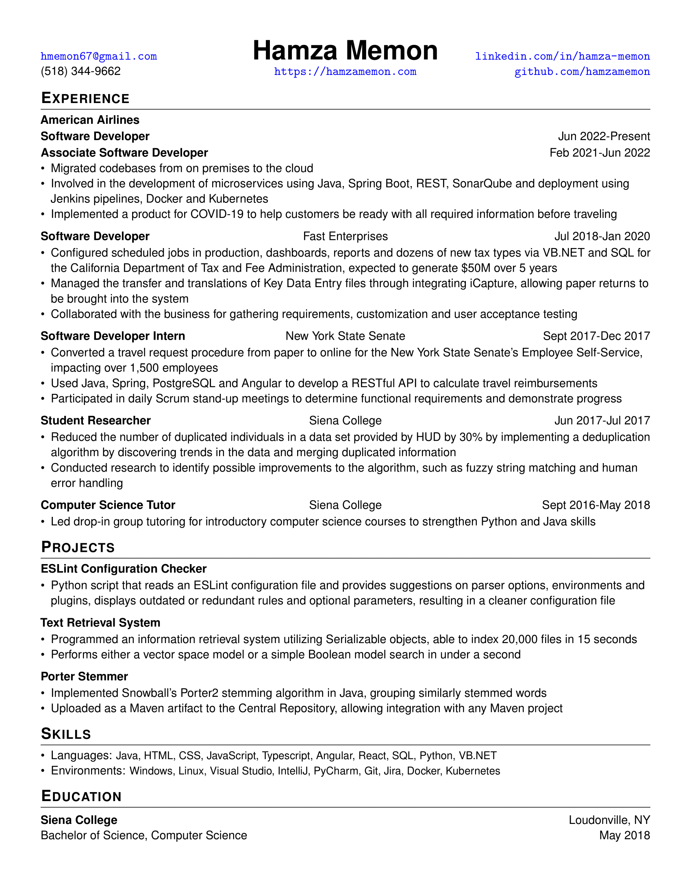

# My Resume
My single-page resume that utilizes LuaLaTeX for advanced features to make updating easier and less
intensive, and a common font (Helvetica) for increased out-of-the-box support with the majority of computers.

#### Motivation
This LaTeX template was created to improve the resume creation process over Google Drive and
Microsoft Word. Formatting in these two programs is very inefficient and takes time for more intense
formatting, such as left, center and right justifying in a single line, custom spacing between
paragraphs/lists and columns.

#### Preview

